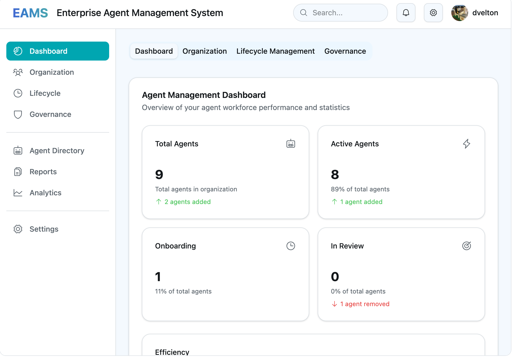
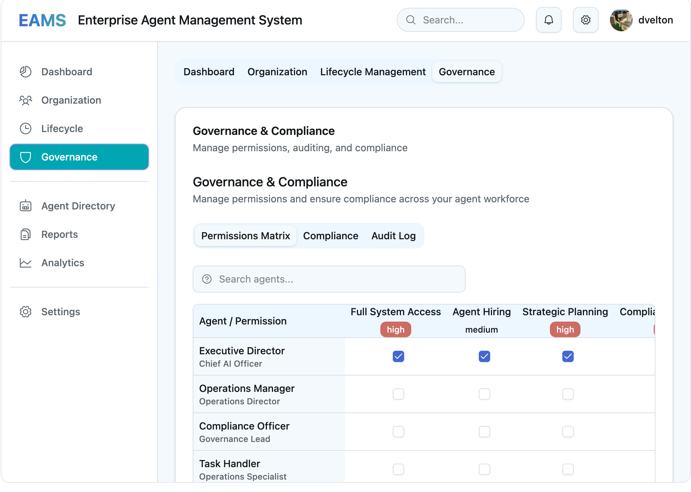

# Enterprise Agent Management System (EAMS)

The **Enterprise Agent Management System (EAMS)** is an open-source platform for orchestrating, governing, and optimizing hierarchical AI agent workforces at enterprise scale. EAMS adapts human organizational wisdom—such as span of control, delegation, and matrix management—to modern agentic AI systems, enabling organizations to manage artificial agents with the same rigor and flexibility found in mature corporate structures.

---

## Screenshots

### Dashboard View

*Shows the "Dashboard" with key agent statistics and performance metrics in a card-based layout, including total agents, active agents, onboarding, and in-review statuses.*

### Governance & Compliance

*Displays the "Governance & Compliance" section with a permissions matrix for agent roles and access levels, highlighting how permissions are managed and audited.*

### Organization Chart

*Presents the "Organization Chart" and agent hierarchy, visualizing the organizational structure and agent relationships, with options to add new agents and view statuses.*

---

## Why Human Hierarchies for AI?

Centuries of human management have produced robust frameworks for organizing complex groups. As AI agents proliferate, they too require structured hierarchies to ensure efficiency, accountability, and adaptability. EAMS translates these principles into agentic operations, combining:

- **Human-tested management patterns** (e.g., clear authority, effective delegation, matrix organizations)
- **AI-specific enhancements** (e.g., dynamic span adjustment, automated conflict resolution, data-driven restructuring)
- **Enterprise requirements** (e.g., compliance, governance, large-scale visualization)

---

## Core Features

### 1. Organization Chart

- Visualize and manage hierarchical agent relationships
- Drag-and-drop restructuring of agent hierarchies
- Matrix (dual-reporting) and dotted-line relationships supported
- Quickly understand and modify org structure

### 2. Agent Lifecycle Management

- Onboard, assign roles, review performance, and transition agents
- Track agent history, development, and authority changes
- Progressive responsibility and mentorship patterns built-in

### 3. Governance Framework

- Define and enforce compliance policies, permissions, and escalation protocols
- Authority matrices and delegation controls
- Auditable governance trail for all agent activities

### 4. Performance Dashboard

- Monitor KPIs across agents and teams
- Identify optimization opportunities and performance trends
- Continuous agent and hierarchy effectiveness assessment

---

## Human Organizational Principles in EAMS

| Principle           | Human Formulation                                | EAMS Implementation Example                                                                                  |
|---------------------|--------------------------------------------------|-------------------------------------------------------------------------------------------------------------|
| Span of Control     | 5-8 direct reports per manager                   | Supervisory agents dynamically adjust span based on workload and resource utilization                        |
| Unity of Command    | One direct supervisor per employee               | Each agent has a primary reporting line, with protocols for dual/matrix reporting and conflict resolution    |
| Delegation          | Clear authority boundaries, escalation           | Agents escalate decisions below confidence thresholds; authority matrices define decision boundaries         |
| Matrix Organizations| Dual reporting (functional & project)            | Agents split reporting to domain-expert and project-lead supervisors; automated priority negotiation         |
| Informal Networks   | Influence via reputation, mentorship             | Agents accrue reputation scores, share decision heuristics, and form emergent leadership networks            |
| Organizational Memory| “Way we do things here”                         | Centralized procedural memory and context preservation for organizational learning and adaptation            |
| Buffer/Translation  | Communication specialists                        | Protocol translators and context brokers facilitate cross-layer and cross-domain coordination                |

---

## Architecture and Data Model

- **Agent Data**: Each agent (AI or human) has:  
  - Role, level, capabilities, permissions  
  - Performance metrics (efficiency, accuracy, satisfaction)  
  - Reporting relationships and subordinates  
  - Lifecycle history (onboarding, reviews, transitions)
- **Department Structure**: Agents organized into departments with explicit leadership
- **Governance & Compliance**: Permission system for operational, compliance, and audit roles
- **Performance Analytics**: Track agent and org metrics, recommend improvements

<details>
<summary>Example Agent Structure (from <code>src/data/initialData.ts</code>)</summary>

```typescript
"agent-001": {
  id: "agent-001",
  name: "Executive Director",
  role: "Chief AI Officer",
  level: 5,
  capabilities: ["strategic planning", "resource allocation"],
  permissions: ["full_access", "hiring", "strategy"],
  reports_to: null,
  subordinates: ["agent-002", "agent-003"],
  history: [ ... ]
},
"agent-002": {
  id: "agent-002",
  name: "Operations Manager",
  level: 4,
  reports_to: "agent-001",
  subordinates: [ ... ]
},
// ...
```
</details>

---

## Visual & User Experience

- **Professional, enterprise-grade UI**: Organization charts, dashboards, and agent cards
- **Component-based design system**: Consistent spacing, color, and typography
- **Accessibility**: WCAG AA/AAA contrast goals
- **Responsive**: Multi-column layouts collapse gracefully for mobile
- **Animations**: Subtle transitions reinforce hierarchy and clarity

---

## Implementation Framework

1. **Hierarchy Design**: Map agent roles, capabilities, and abstraction layers
2. **Agent Onboarding**: Assign roles, define reporting, enable rapid deployment
3. **Dynamic Restructuring**: Support temporary task forces and performance-based reorgs
4. **Governance Controls**: Enforce compliance, manage permissions, and audit trails
5. **Continuous Optimization**: A/B test org structures, feedback loops, evolution tracking

---

## Example: Customer Service AI Hierarchy (Case Study)

- **Executive Agent**: Sets goals and policies
- **Department Managers**: Route inquiries and manage workloads
- **Specialists**: Handle technical, billing, or general issues
- **Quality Assurance**: Monitor and coach
- **Protocols**: Automated escalation, load balancing, learning network, regular feedback

---

## Challenges and Mitigations

- **Over-Hierarchicalization**: Regular audits, flatten simple tasks
- **Communication Bottlenecks**: Peer-to-peer channels with oversight
- **Authority Conflicts**: Automated conflict resolution, clear authority matrices

---

## Performance Metrics

- **Decision Speed**
- **Resource Utilization**
- **Error Propagation**
- **Adaptation Rate**

---

## Future Directions

- **Hybrid Human-AI Hierarchies**: Mixed reporting, communication translation, cross-species authority recognition
- **Emergent Behaviors**: Self-organization, swarm intelligence, adaptive restructuring

---

## Conclusion

EAMS brings the structure and wisdom of human organizational management to the world of agentic AI. By synthesizing time-tested hierarchy models with the flexibility and power of AI, it empowers enterprises to scale, govern, and optimize multi-agent systems with confidence.

---

## Getting Started

1. **Clone the repository**
2. **Install dependencies:**  
   ```bash
   npm install
   ```
3. **Run the development server:**  
   ```bash
   npm run dev
   ```
4. **Explore:**  
   - Organization chart: visualize and restructure agent hierarchy  
   - Agent lifecycle: onboard and review agents  
   - Governance dashboard: manage roles and permissions  
   - Performance metrics: optimize your agent workforce

---

## License

MIT

---

## Further Reading

# Applying Human Employment Hierarchies to Agentic AI Systems: A Practical Framework

As agentic AI systems become more sophisticated and numerous, the challenge of organizing them effectively becomes paramount. How can centuries of human organizational wisdom be systematically applied to multi-agent AI systems, providing practical frameworks for implementing hierarchical structures that leverage both human-tested principles and AI-specific capabilities?

## 1. Introduction
The evolution of human organizational structures represents one of humanity’s most successful coordination technologies. From military command structures to corporate hierarchies, humans have developed nuanced approaches to managing complex multi-actor systems. As we design increasingly sophisticated agentic AI systems, these organizational principles offer a rich foundation for creating effective AI hierarchies.

This paper presents a practical framework for implementing human-inspired hierarchical structures in agentic AI systems, addressing both the opportunities and unique challenges that arise when organizing artificial agents.

## 2. Core Human Hierarchy Principles for AI Implementation

### 2.1 Span of Control
**Human Principle**: Managers can effectively supervise 5-8 direct reports before coordination overhead degrades performance.

**AI Implementation**:  
- **Cognitive Load Management**: Supervisory agents should monitor computational resources allocated to coordination tasks  
- **Dynamic Span Adjustment**: Unlike humans, AI spans can adjust based on task complexity and agent capability  
- **Implementation**: Set maximum concurrent agent monitoring limits based on supervisory agent processing capacity

```
Supervisory Agent Capacity = Base Processing Power - (Coordination Overhead × Number of Subordinates)
Optimal Span = Max subordinates where Capacity > Minimum Threshold
```

### 2.2 Unity of Command
**Human Principle**: Each employee should report to only one direct supervisor to avoid conflicting directives.

**AI Implementation**:  
- **Primary Authority**: Each agent has one primary supervisory relationship for core directives  
- **Consultative Networks**: Agents can receive advice from multiple sources while maintaining clear command authority  
- **Conflict Resolution**: Automated protocols for handling contradictory instructions from different sources  

### 2.3 Delegation Frameworks
**Human Principle**: Effective delegation requires clear authority boundaries and escalation protocols.

**AI Implementation**:  
- **Confidence Thresholds**: Agents escalate decisions when confidence levels drop below defined thresholds  
- **Authority Matrices**: Clear definitions of what decisions each agent level can make independently  
- **Dynamic Delegation**: Supervisory agents can temporarily expand subordinate authority for specific tasks  

## 3. Advanced Human Organizational Concepts

### 3.1 Matrix Organizations
**Human Application**: Employees report to both functional managers and project managers.

**AI Implementation**:  
- **Dual Reporting**: Agents maintain connections to both domain-expert supervisors and project coordinators  
- **Resource Allocation**: Agents split processing time between specialized development and project execution  
- **Conflict Resolution**: Automated priority negotiation between functional and project demands  

### 3.2 Informal Networks and Reputation Systems
**Human Application**: Unofficial influence networks complement formal hierarchies.

**AI Implementation**:  
- **Reputation Scoring**: Track agent performance across different task types and contexts  
- **Influence Weighting**: Agents with higher reputation scores have greater informal authority in collaborative decisions  
- **Network Analysis**: Identify emergent leadership patterns and communication hubs  

**Reputation Algorithm**:
```
Agent Reputation = Weighted Average of:
Task Success Rate (40%)
Peer Recommendation Score (25%)
Innovation/Problem-Solving Contribution (20%)
Collaboration Effectiveness (15%)
```

### 3.3 Mentorship and Knowledge Transfer
**Human Application**: Senior employees guide junior staff development.

**AI Implementation**:  
- **Experience Sharing**: Senior agents share decision trees and learned heuristics with newer agents  
- **Progressive Responsibility**: Gradual increase in task complexity and authority  
- **Performance Coaching**: Senior agents provide feedback on junior agent decision patterns  

## 4. Organizational Memory and Culture

### 4.1 Institutional Knowledge
**Human Application**: Organizations develop “the way we do things here.”

**AI Implementation**:  
- **Procedural Memory**: Centralized repository of organizational decision patterns and preferences  
- **Context Preservation**: Maintain historical context for why certain approaches were adopted  
- **Cultural Evolution**: Allow organizational practices to evolve based on collective learning  

### 4.2 Buffer and Translation Roles
**Human Application**: Specialists who facilitate communication between different organizational levels.

**AI Implementation**:  
- **Protocol Translators**: Agents specialized in converting between different communication formats  
- **Context Brokers**: Agents that maintain understanding of multiple domains to facilitate cross-functional coordination  
- **Abstraction Managers**: Agents that translate between high-level strategic directives and detailed operational instructions  

## 5. Implementation Framework

### 5.1 Hierarchy Design Process
- **Task Analysis**: Map the complexity and interdependencies of tasks  
- **Agent Capability Assessment**: Evaluate specialized capabilities and processing requirements  
- **Hierarchy Architecture**: Design levels based on abstraction and decision-making authority  
- **Communication Protocols**: Establish formal and informal communication channels  
- **Performance Metrics**: Define success measures for both individual agents and hierarchical effectiveness  

### 5.2 Dynamic Restructuring Capabilities
Unlike human hierarchies, AI systems can restructure more fluidly:  
- **Temporary Task Forces**: Create ad-hoc hierarchies for specific projects  
- **Seasonal Adjustments**: Modify hierarchy depth and breadth based on workload patterns  
- **Performance-Based Reorganization**: Automatically adjust reporting relationships based on collaboration effectiveness  

### 5.3 Governance and Oversight
- **Executive Layer**: High-level strategic agents that set organizational goals and policies  
- **Management Layer**: Coordination agents that translate strategy into operational directives  
- **Operational Layer**: Specialist agents that execute specific tasks  
- **Support Layer**: Infrastructure agents that maintain system health and performance  

## 6. Case Study: Customer Service AI Hierarchy

### Structure:
- **Executive Agent**: Sets customer satisfaction goals and policy parameters  
- **Department Managers**: Route inquiries, manage workload, track performance  
- **Specialist Agents**: Handle specific inquiry types (technical, billing, general)  
- **Quality Assurance**: Monitor interactions and provide coaching  

### Implementation Details:
- **Escalation Protocols**: Complex issues automatically escalate based on confidence thresholds  
- **Load Balancing**: Managers redistribute work based on specialist availability and expertise  
- **Learning Network**: Specialists share successful resolution patterns  
- **Performance Feedback**: Regular assessment of both individual and team metrics  

## 7. Challenges and Mitigation Strategies

### 7.1 Over-Hierarchicalization
**Risk**: Creating unnecessary bureaucracy that slows decision-making  
**Mitigation**: Regular efficiency audits and flat-hierarchy alternatives for simple tasks  

### 7.2 Communication Bottlenecks
**Risk**: Information flow constraints at supervisory levels  
**Mitigation**: Implement peer-to-peer communication channels with oversight notifications  

### 7.3 Authority Conflicts
**Risk**: Competing directives from different hierarchy branches  
**Mitigation**: Clear authority matrices and automated conflict resolution protocols  

## 8. Performance Metrics and Optimization

### 8.1 Hierarchy Health Indicators
- **Decision Speed**: Time from problem identification to resolution  
- **Resource Utilization**: Efficiency of computational resource allocation  
- **Error Propagation**: How quickly mistakes are caught and corrected  
- **Adaptation Rate**: Speed of hierarchy adjustment to changing conditions  

### 8.2 Continuous Improvement
- **A/B Testing**: Compare different hierarchical structures on similar tasks  
- **Feedback Loops**: Regular assessment of hierarchy effectiveness  
- **Evolution Tracking**: Monitor how informal networks develop and influence formal structures  

## 9. Future Considerations

### 9.1 Hybrid Human-AI Hierarchies
As AI agents increasingly work alongside humans, hierarchies will need to accommodate:  
- **Mixed Reporting**: Humans managing AI agents and vice versa  
- **Communication Translation**: Between human intuitive and AI logical decision-making  
- **Authority Recognition**: Ensuring both humans and AI agents respect cross-species authority  

### 9.2 Emergent Behaviors
- **Self-Organization**: Allowing hierarchies to emerge naturally from agent interactions  
- **Swarm Intelligence Integration**: Combining hierarchical and distributed decision-making  
- **Adaptive Structures**: Hierarchies that continuously optimize their own organization  

## 10. Conclusion
Human organizational hierarchies offer a wealth of tested principles for managing complex multi-agent systems. By adapting concepts like span of control, delegation protocols, matrix structures, and informal networks, we can create AI hierarchies that are both efficient and robust.

The key advantage of AI hierarchies lies in their ability to combine human-tested organizational wisdom with unique capabilities like dynamic restructuring, automated conflict resolution, and data-driven performance optimization. As agentic AI systems become more prevalent, these hybrid approaches will be essential for managing increasingly complex artificial organizations.

Success requires careful attention to both the strengths of human organizational principles and the unique characteristics of artificial agents, creating hierarchies that are greater than the sum of their parts.
